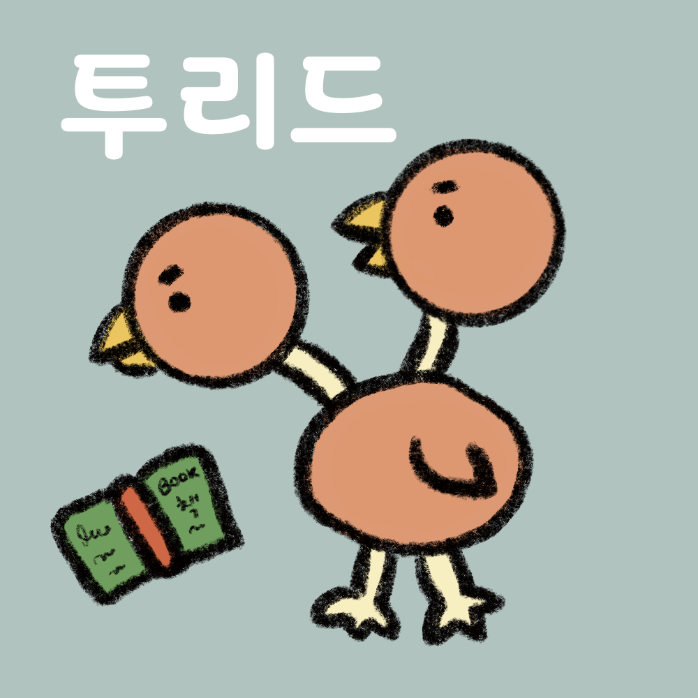
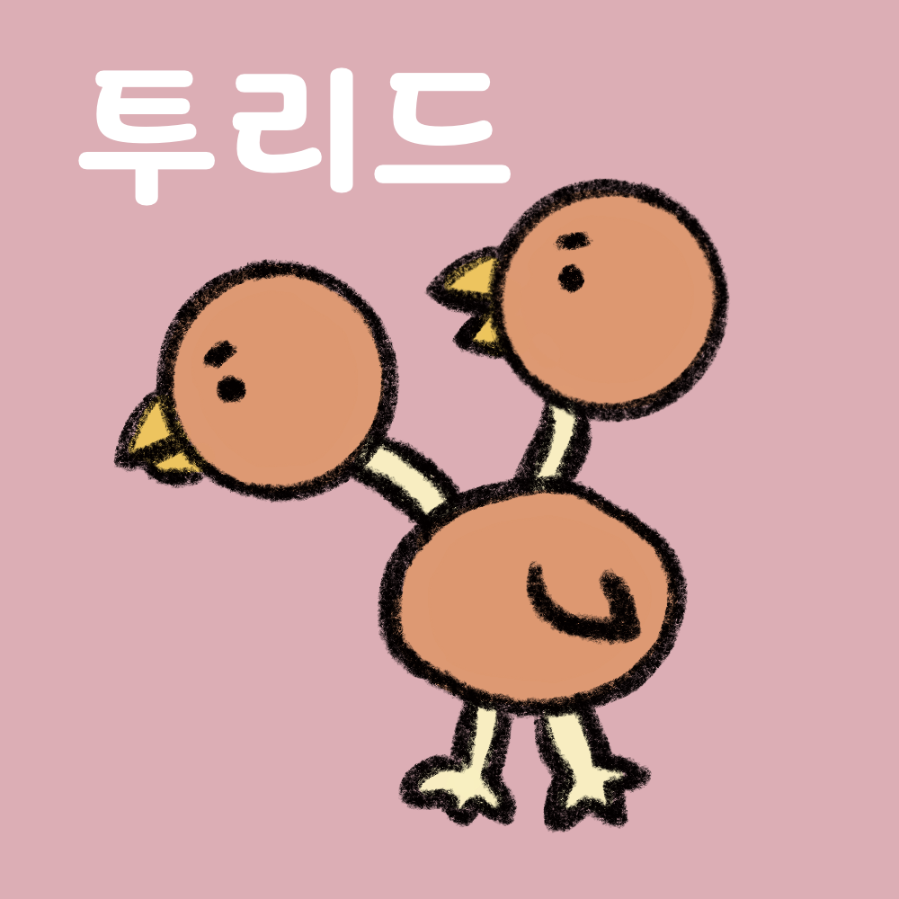

# 투리드

## 투리드 독서 모임 조항

1. 독서 모임은 2022년 한해 동안 운영되며, 2022년 2월부터 시작한다. (이후 유지는 나중에 멤버끼리 합의로 결정)
2. 참여 멤버는 특정 기간(월 단위만 가능) 내 몇 권의 책을 읽겠다는 것을 스스로 정한다.
    - Ex) 한 달에 1권 읽기, 두 달에 1권 읽기
    - 책의 기준은 글씨가 적힌 종이가 묶여진 형태의 것으로 한다.
    - 목표는 연 1회에 한해 변경 가능하다.
    - 목표 도중 변경을 원할 경우, 벌금 1만원을 내고 변경 가능하다.
3. 2번 조항의 목표를 달성한 것을 인증하기 위해, 목표 마지막 날까지 읽은 책의 줄거리 소개(2~3문장으로 간단히 소개 가능)와 추천 여부를 독서 모임 멤버 모두에게 공유한다.
    - 공유하는 방법은 slack 투리드 방에 업로드하여 인증한다. (슬랙에 직접 작성 또는 작성 내용 링크(ex.노션, 블로그 등)또는 손글씨 사진 인증 가능)
    - 만약 목표가 2022년에 시작하였으나, 목표 인증 날이 2022년을 넘기게 되는 경우에 한해서 2023년까지 연장하여 인증 가능하다.
        - Ex) 목표를 3달에 1권으로 설정한 경우, 마지막 목표는 2022년 11월에 시작하므로, 인증은 2023년 1월까지 가능하다.
4. 목표 시 읽을 책은 목표 시작 전까지 slack 투리드 방에 미리 공개해서 인증해야 한다.
5. 3번 또는 4번 조항에 대한 인증을 성공하지 못한 경우, 벌금을 낸다.
    - 벌금은 운동 벌금 계좌에 입금해야 한다.
    - 벌금은 형평성을 고려하여 (목표 개월 수) x (1만원)으로 정한다.
    -  ex) 한 달에 1권일 경우 => 1개월 x 1만원 = 1만원(1개월마다)
    -      두 달에 1권일 경우 => 2개월 x 1만원 = 2만원(2개월마다)
    -      여섯 달에 1권일 경우 => 6개월 x 1만원 = 6만원(6개월마다)
    - 벌금은 목표 실패 후 일주일 내 내야한다.
    -   만약 벌금을 기한 내에 내지 않은 경우, 두배로 증가한다.

### 책의 기준에 대한 예시
- 만화책? 글씨 써져 있고 종이 묶여져있으므로 OK~ (그림만 그려져 있다면 NOT OK!)
- 동화책? 그림만 그려져 있는 그림책 아니고 글씨 써져 있고 낱장 아니면 OK~
- 팜플렛? 글씨는 써져 있지만 낱장이면 삐삐~ 안됨~~

## 이두

- 이두는 투리드의 마스코트이다.
- 포켓몬스터의 [두두](https://pokemon.fandom.com/ko/wiki/%EB%91%90%EB%91%90_\(%ED%8F%AC%EC%BC%93%EB%AA%AC\))를 모티브로 창작되었으며, 창작자는 [@ddome](https://www.instagram.com/ddome09876/)다.
    - (news) ddome는 이두를 작품 소개 인스타에 올리지 않았다... 😞

